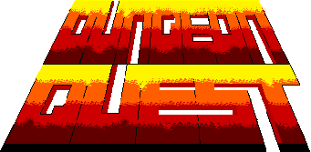
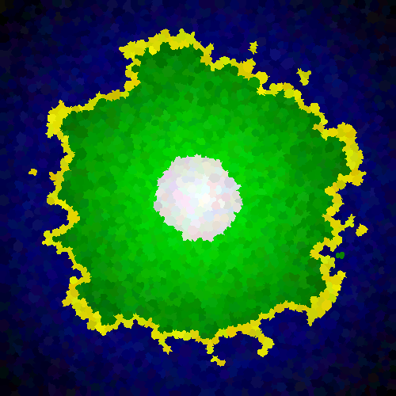

## License
This project is licensed under the [MIT license](http://opensource.org/licenses/mit-license.php)

## Website
https://dungeonquest-77fa9.web.app/

## API
### Example
#### Request
```
curl -X POST https://2t9633uwf6.execute-api.us-east-2.amazonaws.com/Prod/dungeonquest \
  -H "Content-Type: application/json" \
  -d {DungeonQuestBody}
```
##### Body
```json
{
  "path": "/dungeonquest",
  "httpMethod": "POST",
  "headers": {
    "Content-Type": "application/json"
  },
  "body": {
    "map_scale": 4,
    "map_smoothing_count": 5,
    "water_level": 0.4,
    "coast_level": 0.45,
    "white_cap_level": 0.85,
    "erosion_start_percent": 0.5,
    "erosion_spread_percent": 0.8,
    "erosion_max_spread": 20,
    "erosion_max_steps": 20,
    "number_of_dungeons": 10,
    "number_of_rooms": 10,
    "minimum_room_width": 5,
    "maximum_room_width": 10,
    "minimum_room_height": 5,
    "maximum_room_height": 10,
    "common_item_chance": 0.5,
    "uncommon_item_chance": 0.3,
    "rare_item_chance": 0.15,
    "legendary_item_chance": 0.04,
    "mystical_item_chance": 0.01,
    "major_characters": ["Atticus Finch", "Indiana Jones", "Rick Blaine"],
    "monster_categories": ["Celtic mythology", "Egyptian mythology", "Greek mythology"],
    "artifact_categories": ["Armor", "Swords", "Shields"]
  }
}
```
#### Response
```json
    {
  "map": {
    "dungeonSites": {
      "sites": [
        {
          "dungeonSiteName": "...",
          "x": 0,
          "y": 0
        }
      ]
    },
    "mapImage": "..."
  },
  "dungeons": {
    "dungeons": [
      {
        "rooms": [
          {
            "roomImage": "...",
            "roomType": "..."
          }
        ]
      }
    ]
  },
  "quests": {
    "quests": [
      {
        "questLogs": [
          {
            "dungeonType": "...",
            "questLog": "..."
          }
        ]
      }
    ]
  }
}
```
## Command Line Interface
### Menu
```
╔══════════════════════════════════════════════════════════════╗
║                    DungeonQuest Command Line                 ║
╚══════════════════════════════════════════════════════════════╝

Type '!help' for detailed command information or try these commands:
• !params          - View current parameter settings
• !map             - Generate a map
• !dungeon         - Generate a dungeon overview and room
• !quest           - Generate a single quest
• !lists           - View available quest content
• !quit            - Exit the application
```
### Map Generation
```
DungeonQuest> !map
Generating map...
Exported to: map.html
View it in your browser: file:/Users/davidmarino/Desktop/DungeonQuest/map.html
Map generated successfully! Open 'map.html' in your browser to view.
```

